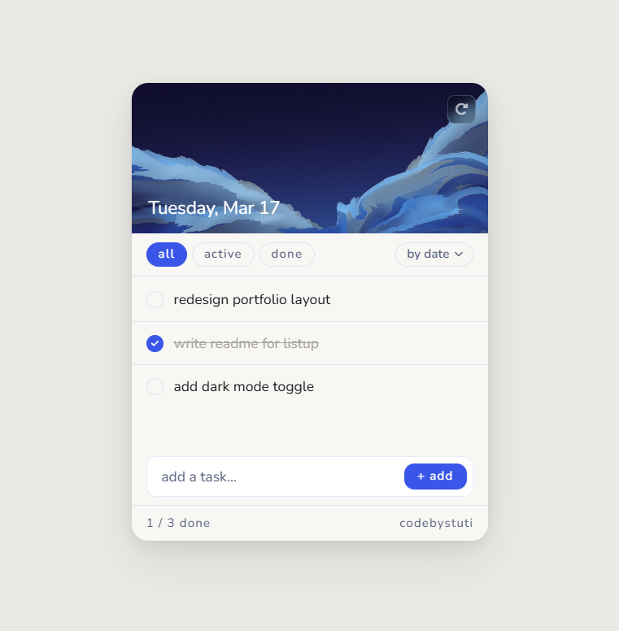

# listup

Started as a YouTube tutorial project. Rebuilt it completely — different UI, added features, cleaned up the code until it felt like something I'd actually want to use.

**[Live Demo](https://codebystuti.github.io/listup)**

---

---

## What it does

- Add, complete, and delete tasks
- Filter by all / active / done
- Sort by date added or alphabetically — uses `Date.now()` timestamps stored in localStorage so "by date" is always accurate, even after deletions
- Inline edit — double-click any task to edit it in place
- Undo on delete and clear all — 4 second window before the action commits
- Background image changes on every load, pulled randomly from a pool of Unsplash photos
- Data persists in `localStorage` — tasks survive page refresh

## Technical bits worth noting

**Date display** uses `Intl.DateTimeFormat` via `toLocaleDateString` with the `en-US` locale — renders the full weekday, month and day without any library.

**Sort** works by comparing `createdAt` timestamps on each task object. Alphabetical sort uses `localeCompare` which handles case and special characters correctly.

**Custom dropdown** built from scratch with full keyboard navigation — Arrow keys, Enter, Escape, Tab all work. No native `<select>` element.

**Undo** stores a snapshot of the deleted item (or full list on clear all) with its original index, then restores it if the user hits undo before the 4 second timer fires.

**Animations** are all CSS keyframes — enter, exit, card load, dropdown, toast. The exit animation collapses the item height to zero after fading so the list closes smoothly without a jump.

## Stack

Vanilla JS · Bootstrap 5 (layout utilities only) · Font Awesome · Nunito via Google Fonts

## Run locally

open in browser. No install, no build step.

---

*codebystuti*
